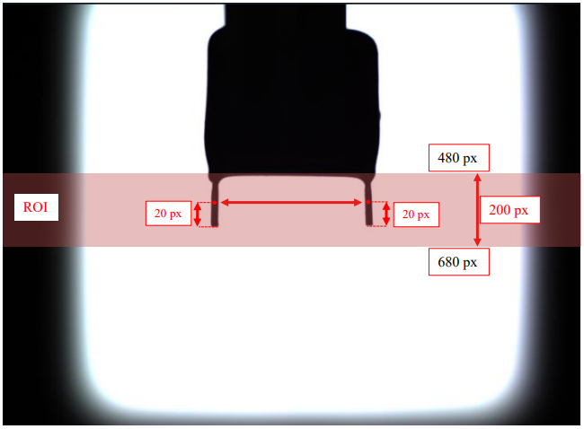
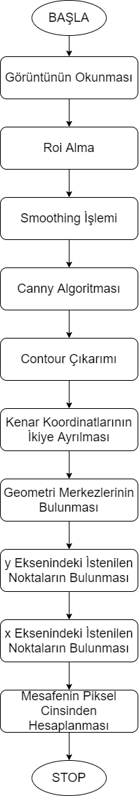
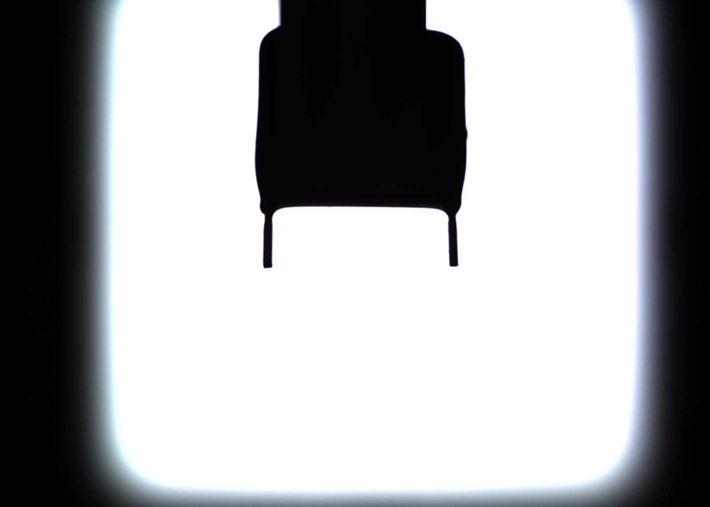
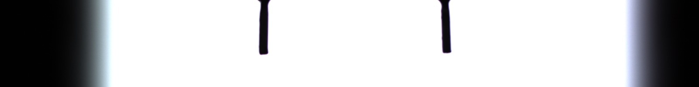
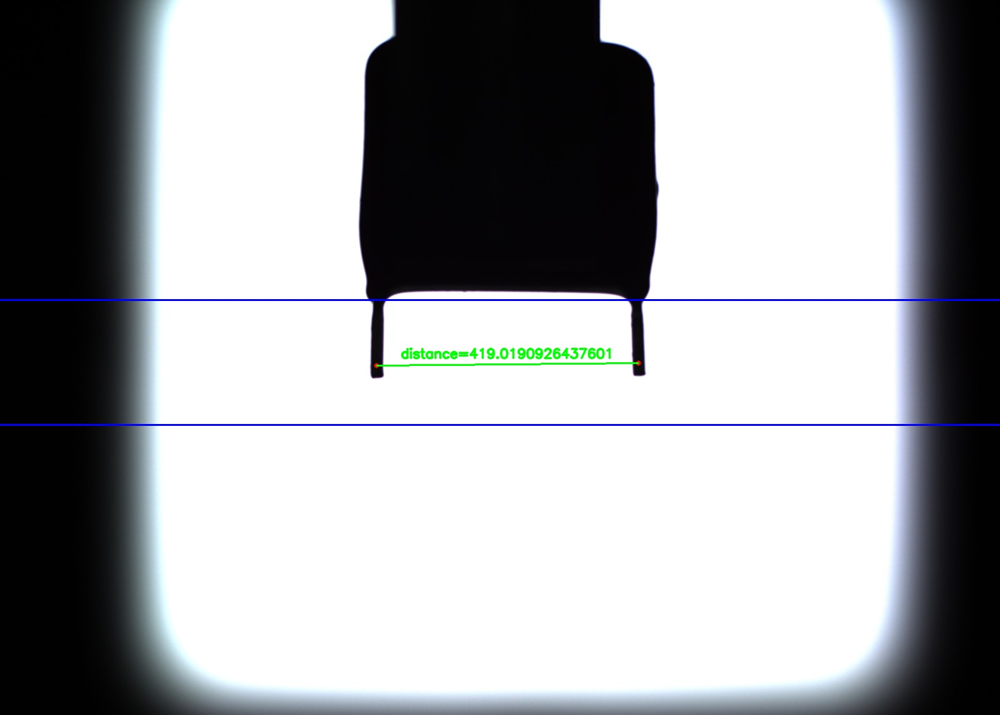
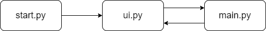
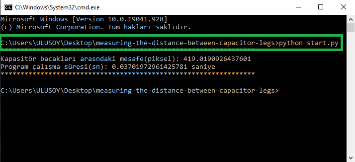
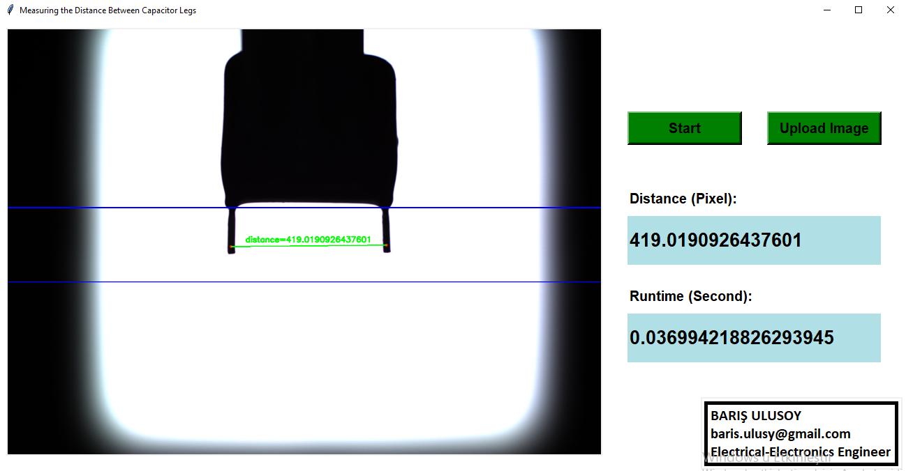

# KAPASİTÖR BACAKLARI ARASINDAKİ MESAFENİN PİKSEL CİNSİNDEN ÖLÇÜLMESİ

Yukarıdaki görüntüde gripper tarafından tutulan kapasitör gösterilmektedir. Bu kapasitörün
bacakları arasındaki mesafe aşağıdaki verilen şartlara göre piksel cinsinden ölçülecektir. 

- Bacaklar arası mesafeyi, kapasitör bacaklarının en alt noktasından 20 px yukarı gelen 
   noktadan ve bacakların orta noktasını bularak ölçünüz.
- Bacakları y ekseninde 480 – 680 px aralığında 1600x200 px’lik bir ROI belirleyerek 
   otomatik olarak bulunuz.

## 1. Çözüm Yönteminin Açıklanması

Projede kullanılan kütüphaneler aşağıda kısaca açıklanmıştır:

**Numpy:** Numpy, bilimsel hesaplama işlemleri, çok boyutlu diziler, çeşitli türetilmiş nesneler 
dahil olmak üzere diziler üzerinde hızlı işlemler yapılabilmesi için kullanılan önemli 
kütüphanelerden birisidir. Görüntü işleme ve yapay zeka uygulamalarında, minimum kod 
yazarak, hesaplama işlemleri ve dönüşüm işlemlerinde sıkça kullanılmaktadır. 

**PIL:** PIL kütüphanesi basit noktasal işlemler, bir dizi yerleşik konvolüsyon çekirdekleri ile 
filtreleme ve renk alanı dönüşümleri gibi temel görüntü işleme işlevlerini gerçekleştirmek için 
kullanılan bir kütüphanedir.

**OpenCV:** OpenCV, bilgisayarlı görü uygulamaları ve ticari ürünlerde makine öğrenme algısını 
hızlandırmak için hazırlanmış bir kütüphanedir. 

Aşağıda problemin çözümü için kullanılacak akış şeması gösterilmiştir:

Bu sorunun çözümü adım adım aşağıda ayrıntılı olarak açıklanmıştır:

### ADIM-1: Görüntünün Okunması

OpenCV kütüphanesi kullanılarak görüntü okumak için imread() fonksiyonu kullanılır. 
Aşağıdaki şekilde okunmuş görüntü gösterilmiştir.

### ADIM-2: Roi Alma

ROI (Region of Interest) kullanılarak görüntü üzerinde herhangi istenen bir bölgeye pikseller 
ile erişip o bölge üzerinde istenen işlemler gerçekleştirilebilir. Roi alma işleminin sonucu 
aşağıdaki şekilde gösterilmiştir.

### ADIM-3: Smoothing İşlemi

Görüntü işlemede, görüntüyü yumuşatmak yada kenarları belirginleştirmek için dijital 
smoothing filtreleri kullanılır. Girdi görüntüsü f(i,j), filtre fonksiyonu h(i,j) ile konvolüsyon 
yapılarak filtreleme işlemi gerçekleştirilir. Konvolüsyon işlemi; bir çekirdek şablonunun
(matrisin/kernel) resim üzerindeki piksellerle 'kaydırma ve çarpma' işlemi olarak 
tanımlanabilir.

Roi alınmış görüntüye bilateral filtresi uygulanmıştır. Bilateral filtresi, kenarları keskin 
tutmaktadır ve gürültü gidermede oldukça etkilidir. İkili filtreleme, iki adet farklı Gauss filtresi 
almaktadır. Bu yüzden bu filtreye ikili filtredenilmektedir. İlk Gauss işlevi, yumuşatma için 
yalnızca yakın piksellerin dikkate alınmasını sağlamaktadır. Diğer Gauss filtresi ise, 
bulanıklaştırma için yalnızca merkezi piksele benzer yoğunluklardaki pikselleri dikkate 
almaktadır. Bu nedenle, kenarlardaki pikseller büyük yoğunluk değişimine sahip olacağından 
kenarlar daha belirgin hale gelecektir. Bilateral filtesi uygulanmış görüntü aşağıdaki şekilde 
gösterilmiştir. 

### ADIM-4: Canny Kenar Belirleme Yöntemi

Görüntüdeki kenar noktalarının tespiti ile bir görüntü içindeki nesnelerin sınırları 
belirlenmektedir. Çeşitli kenar belirleme algoritmaları bulunmaktadır. Bu çalışmada Canny 
Algoritması kullanılmıştır. Bu algoritma; keskin kenarlar ve gürültü bağışıklığı açısından diğer 
algoritmaların önüne geçmektedir. Canny algoritması uygulanmış görüntünün sonucu aşağıdaki 
şekilde gösterilmiştir. 

Bulunan kenarların olduğu piksel koordinatlarının bulunması gerekmektedir. Bu işlem numpy 
kütüphanesi içerisinde bulunan nonzero() fonksiyonu ile hızlı bir şekilde yapılmaktadır. Bu 
fonksiyon matris içerisinde bulunan değeri sıfır olmayan indexleri döndürmektedir.

### ADIM-5: Contour Çıkarımı

Görüntü işlemede kontur denilen kavram, bir rengin veya yoğunluğunun sahip olduğu tüm 
sürekli noktaları birleştiren kapalı bir eğridir. Konturlar bir görüntüde bulunan nesnelerin 
şekillerini temsil eder. Contour çıkarımının uygulanabilmesi için görüntünün eşiklenmiş 
olması veya görüntü üzerindeki kenarların algılanmış olması gerekmektedir.

Bu çalışmada iki farklı contour bulunabilmektedir. Örneğin; kapasitör bacakları aşağıdaki gibi 
konumlandırılmış ise iki adet contour tespit edilir.

Kapasitör bacakları aşağıdaki gibi konumlandırılmış ise iki adet contour tespit edilir.

### ADIM-6: Geomeri Merkezlerinin Bulunması

Geometri merkezinin bulunabilmesi için görüntü üzerinde bulunan contourların çıkartılması 
gerekmektedir. Adım-5 bu yüzden gerçekleştirilmiştir. 2 adet contour var ise 2 adet geometri 
merkezi olacaktır. Bu geometri merkezleri aşağıdaki şekilde gösterilmiştir. 

İki adet geometri merkezi var ise bu iki geometri merkezi arasındaki orta nokta hesaplanır. Eğer 
görüntü üzerinde 1 adet contour var ise 1 adet geometri merkezi olacaktır. Bu geometri merkezi 
aşağıdaki şekilde gösterilmiştir.

### ADIM-7: Kenar Koordinatlarının İkiye Ayrılması

Hesaplanan centroid merkezinin x koordinatı baz alınarak kenar koordinatlarının tutulduğu dizi 
sol ve sağ olmak üzere ikiye bölünür. Yani kısaca görüntü geometri merkezlerinin bulunduğu 
x koordinatından ikiye bölünür. Numpy kütüphanesinde bulunan where() metodu ile ikiye 
bölme işlemi hızlı bir şekilde gerçekleştirilir. Bu metod sonucunda centroid merkezinin solunda 
ve sağında bulunan kenarların koordinatlarının bulunduğu indexler return edilmektedir.
Aşağıdaki şekiller üzerinde bölme işlemi ayrıntılı olarak gösterilmiştir. 

### ADIM-8: Sol ve Sağ Kapasitör Bacaklarının y Eksenindeki Maks Koordinatının Bulunması

Sol ve sağ kapasitör bacaklarının maksimum y koordinatları ayrı ayrı hesaplanacaktır. Sol ve 
sağ olmak üzere ikiye ayrılmış dizilere Numpy kütüphanesi içerisinde bulunan amax() metodu
uygulanarak maksimum y koordinatları bulunmuştur. Bu koordinatlardan 20 piksel çıkartılarak 
da istenilen y koordinatları bulunmuştur. Aşağıdaki şekil üzerinde yapılan işlem ayrıntılı olarak 
gösterilmiştir.

### ADIM-9: Sol Kapasitör Bacağının x Koordinatının Bulunması

X koordinatının tespit edilebilmesi için öncelikle bulunan y koordinatındaki kenar noktalara 
düşen x koordinatları bulunur. Sol kapasitör bacağı için bulunan bu x koordinatları aşağıdaki 
şekil üzerinde işaretlenmiştir.

Buradaki yeşil noktalar bulunan x koordinatlarını göstermektedir. Sol kapasitör bacağındaki 
nokta hesaplandığı için solda bulunan iki noktanın ortası bize istenilen noktayı verecektir.

### ADIM-10: Sağ Kapasitör Bacağının x Koordinatının Bulunması

X koordinatının tespit edilebilmesi için öncelikle bulunan y koordinatındaki kenar noktalara 
düşen x koordinatları bulunur. Sağ kapasitör bacağı için bulunan bu x koordinatları aşağıdaki 
şekil üzerinde işaretlenmiştir.

Buradaki yeşil noktalar bulunan x koordinatlarını göstermektedir. Sağ kapasitör bacağındaki 
nokta hesaplandığı için sağda bulunan iki noktanın ortası bize istenilen noktayı verecektir.

### ADIM-11: Tespit Edilen İki Nokta Arasındaki Mesafenin Piksel Cinsinden Hesaplanması

Tespit edilen iki nokta arasındaki mesafe hipotenüs teoremi kullanılarak hesaplanmıştır. Sonuç 
aşağıdaki şekil üzerinde ayrıntılı olarak açıklanmıştır. 

## 2. Kullanılan Modüllerin Açıklanması ve Programın Başlatılması

Sistemin çalışabilmesi için 3 adet modül oluşturulmuştur. Bu modüller aşağıdaki şekilde 
gösterilmiştir.

**start.py** modülü ile uygulama başlatılmaktadır. Bu modülü bir ide de çalıştırarak programı 
başlatabilirsiniz veya komut satırı (cmd) açılarak dosyanın bulunduğu dosya yoluna gidilerek 
aşağıdaki kod yazılır ve uygulama başlatılır. 

- python start.py

**NOT:** PIL kütüphanesi bilgisayarınızda mevcut değilse komut satırına **pip install image**
yazarak indirebilirsiniz.

**ui.py** modülü içerisinde kullanıcı arayüzü oluşturulmaktadır. Bu modül içerisinde oluşturulan 
class main.py içerisinde bulunan class’dan kalıtım yapmaktadır. Arayüz sayesinde kapasitör 
bacakları arasındaki mesafe ölçümü kolayca test edilmektedir. Arayüzün kısa bir tanıtımı 
aşağıdaki şekil üzerinde gösterilmiştir. 

Uygulama başlar başlamaz tanımlı görüntü arayüz üzerinde gösterilir. Ölçüm işleminin 
gerçekleştirilmesi için “Start” butonuna basılması gerekmektedir. Görüntünün işlemesi bittiği 
zaman yeniden “Start” butonuna basılırsa ekranda uyarı gösterilecektir. Bu sayede işlenmiş 
görüntü yeniden işlenmeyecektir. Yeni görüntü eklemek için “Upload Image” butonu 
kullanılabilir. Test edilecek görüntüler aşağıdaki dosya yolunda bulunmaktadır. Bu dosya 
yoluna gidilerek test edilecek görüntü yüklenir ve “Start” butonuna yeniden basılır ve görüntü 
işlenir. 

-  measuring-the-distance-between-capacitor-legs\image_input

**main.py** modülü içerisinde görüntü işleme fonksiyonları ve kapasitör bacakları arasındaki 
mesafeyi hesaplamaya yardımcı olacak metotlar bulunmaktadır. 

## 3. Test Verilerini Çoğaltma

Test verileri Keras kütüphanesi içerisinde bulunan metotlar ile arttırılabilmektedir. Veri 
arttırma işlemi Google Colab üzerinde aşağıdaki kod satırları ile gerçekleştirilmiştir. Öncelikle 
kullanılacak sınıf ve metotlar import edilir.

    from keras.preprocessing.image import ImageDataGenerator, array_to_img, img_to_array, load_img

Veri arttırma yönteminin ve hiperparametrelerin seçimi aşağıdaki kod satırında gösterilmiştir.

    datagen = ImageDataGenerator(width_shift_range=0.2,
                             height_shift_range=0.2,
                             shear_range=0.2,
                             fill_mode='nearest')

Veri arttırma işleminin yapılacağı görüntünün dosya okunması işlemi aşağıdaki kod satırlarında 
gösterimiştir.

    img = load_img('/content/drive/MyDrive/IP1_Cap.jpg')
    x = img_to_array(img)
    x = x.reshape((1,) + x.shape)

Okuduğumuz resimden kaç adet darklı resim oluşturmak istiyorsak bunu for döngüsünde 
belirtmemiz gerekir. Bu işlem aşağıdaki kod satırlarında gösterilmiştir.

    i = 0
    for batch in datagen.flow(x, batch_size=1,
                              save_to_dir='/content/drive/MyDrive/arttirma', 
                              save_format='jpg'):
        i += 1
        if i > 50:
            break

Oluşturulan yeni test görüntüleri **input_image** dosyası içerisinde bulunmaktadır. 
